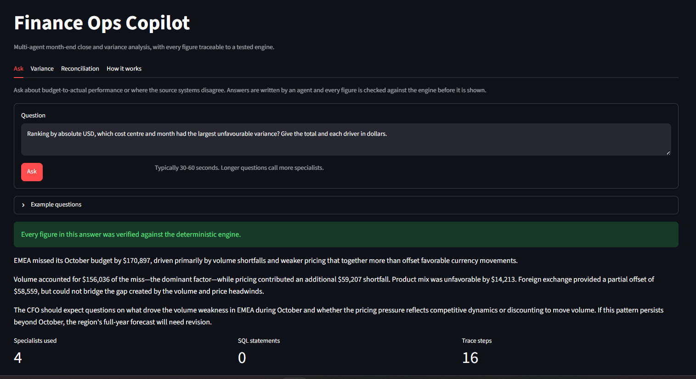
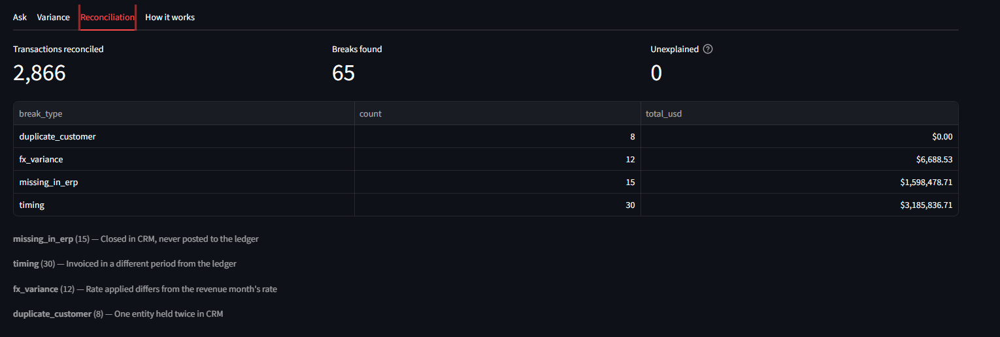
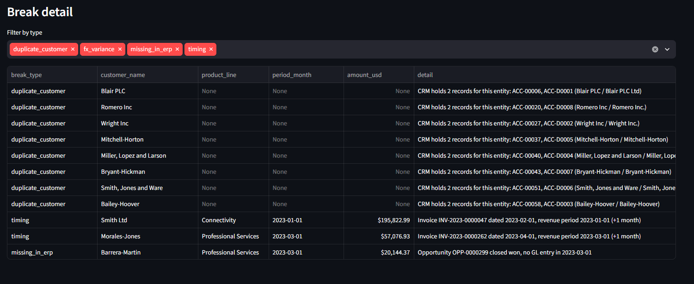
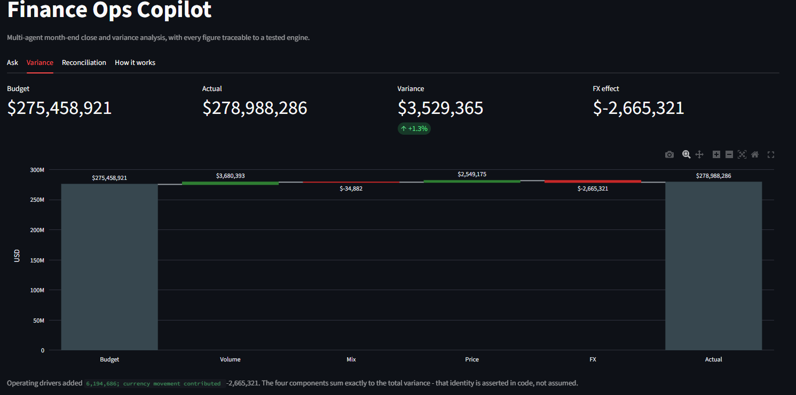
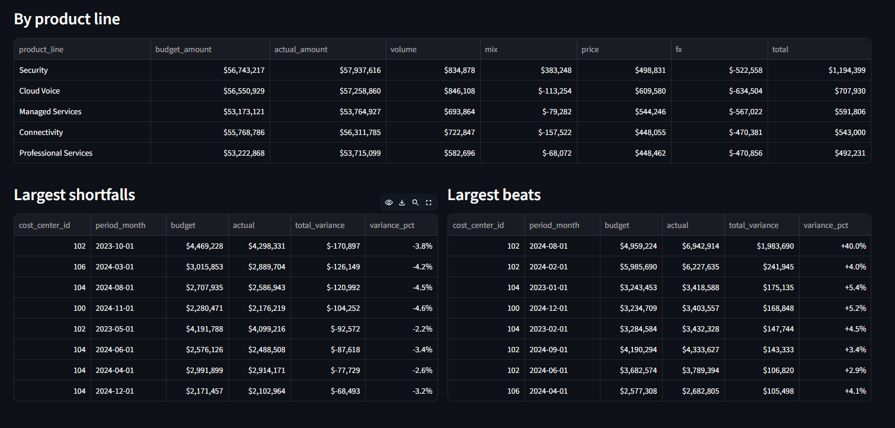
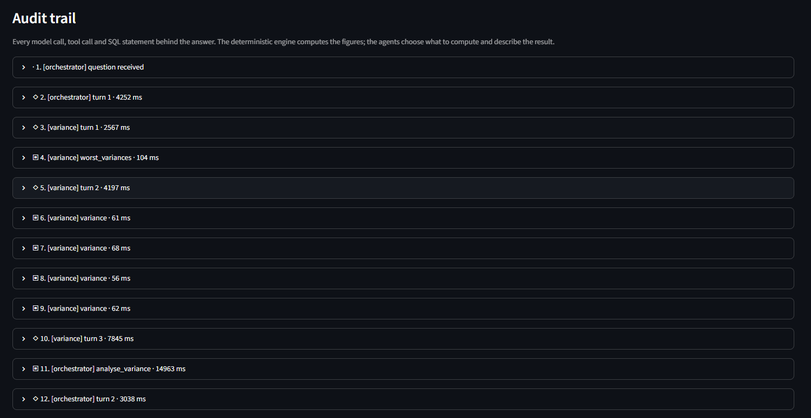

# Finance Ops Copilot

A multi-agent assistant for month-end close and variance analysis. Ask it why a
region missed plan and it reconciles three inconsistent source systems,
decomposes the budget gap into its drivers, and writes commentary in which every
figure can be traced back to a tested calculation.

Built to mirror the manual reconciliation and variance work I did in finance
operations: pull from several systems, work out why they disagree, compare
against plan, and explain the result to leadership.



---

## The problem it solves

Month-end close means answering "why did we miss plan?" using data from systems
that were never designed to agree with each other. Sales says a deal closed. The
ledger has no entry for it. Billing invoiced it a month later in a different
currency. Somebody spends three days in Excel reconciling all of it before
anyone can answer the question.

This does that reconciliation in seconds, decomposes the variance into drivers a
manager can act on, and drafts the commentary — while keeping every number
auditable.

---

## Architecture

```
                          ┌──────────────────┐
                          │   Orchestrator   │  plans and routes
                          └────────┬─────────┘  no data access
             ┌─────────────────────┼─────────────────────┐
             ▼                     ▼                     ▼
      ┌────────────┐      ┌────────────────┐      ┌────────────┐
      │  Variance  │      │ Reconciliation │      │ Retrieval  │
      └─────┬──────┘      └───────┬────────┘      └─────┬──────┘
            │                     │                     │
            ▼                     ▼                     ▼
      ┌───────────────────────────────────┐      ┌─────────────┐
      │   Deterministic engine (tested)   │      │  Read-only  │
      │   reconciliation · variance       │      │  SQL role   │
      └───────────────────────────────────┘      └─────────────┘
                          │
                          ▼
                  ┌──────────────┐      ┌───────────┐
                  │  Commentary  │─────▶│ Validator │  every figure
                  └──────────────┘      └───────────┘  checked, or fallback
```

**The deterministic engine runs first.** Reconciliation matching and variance
decomposition are plain tested Python. No model touches the arithmetic. Agents
call those functions as tools — they decide *what* to compute, never *what the
answer is*.

---

## The data

Three schemas in PostgreSQL, modelled as separate systems that share no join
key, because real ones don't:

| | CRM | ERP | Billing |
|---|---|---|---|
| Customer key | `ACC-00123` | `5001` (integer) | `ap1@acme.com` |
| Dates | TEXT, three formats | `DATE` | `TIMESTAMP` |
| Currency | local | USD only | local + monthly FX |

24 months, ~2,900 transactions, 60 customers across four regions. Identity is
resolved by normalising company names and fuzzy-matching what's left, so
"Acme Ltd", "Acme Limited" and `ap1@acme.com` resolve to one entity.

**65 defects are planted deliberately** and recorded in
[`data/defects_manifest.json`](data/defects_manifest.json) — 15 deals closed in
CRM that never reached the ledger, 30 invoices raised a month late, 12 with a
stale FX rate, 8 duplicated customers, and one genuine 40% trading overrun. The
manifest is the test fixture: the engine has to rediscover all of them without
being told where to look.



Every break carries its own explanation — the invoice, the period it landed in,
and how far it moved:



---

## Variance decomposition

The budget-to-actual gap is split into four drivers:

- **Volume** — units sold against plan
- **Mix** — shift in the blend of product lines, measured against the group's
  total volume so composition is isolated from scale
- **Price** — realised price per unit against plan
- **FX** — currency movement, via constant-currency restatement





The four components **sum exactly to the total variance**, and that identity is
asserted in code on every row rather than assumed. Getting the total right is
easy; getting the attribution right is not, and a wrong mix formula produces
numbers that look entirely plausible.

Across the full period the business beat plan by $3.5M — but $2.7M of operating
gain was given back to currency. A single "+1.3%" tells a CFO nothing; the
decomposition shows the operating story and the currency story pointing in
opposite directions.

---

## Making the agents trustworthy

The narrative layer is the weak point of any system like this, and most of the
engineering went into constraining it.

### Tool access is the guardrail, not the prompt

An early version gave the reconciliation agent a SQL tool. It abandoned the
tested engine and rewrote matching by hand as a join on `LOWER(customer_name)` —
no fuzzy matching, no duplicate resolution, no timing window — then reported
figures the engine never produced. Three rounds of prompt rules didn't stop it.
Removing the tool did.

Each agent now holds only what its role needs. The reconciliation and variance
agents cannot query the database at all. The commentary agent has no tools
whatsoever, so it can only rephrase what it was handed.

### Every figure is validated

Generated commentary is parsed and each number checked against the engine's
output. A failure triggers one retry naming the offending figures; a second
failure falls back to displaying the raw findings.

Real examples the validator caught in testing:

| Draft said | Problem |
|---|---|
| "sold 90% fewer units" | Volume was 90% *of the variance*, not a 90% unit drop |
| "$229,456 before FX" | Derived by adding two figures; appears nowhere |
| "overspend... investigate spending controls" | These are revenue figures; it was a 40% *beat* |
| "$327k timing break explains the $171k variance" | The break is larger than the gap it supposedly explains |

Percentages are held to the same standard as any other figure — a share the
engine computed and passed through is fine to quote; one the agent derived is
not, because nobody can trace it.

### The audit trail

Every model call, tool call and SQL statement is recorded and shown in the UI.
Each of the errors above was visible in the trace before it was visible in the
output.



---

## Measured results

Measured, not asserted — [`eval/evaluate.py`](eval/evaluate.py) runs a fixed
question set repeatedly and reports figure accuracy and answer stability.

Across 12 runs of 6 questions:

- **9 answers passed numeric validation**, every figure traced to the engine
- **3 fell back** to raw engine output rather than shipping unverified prose
- **No unverified figure reached the user in any run**
- Headline conclusions agreed across repeat runs on **50%** of questions, with
  **61% mean overlap** in quoted figures

Raw output is committed at [`eval/results.json`](eval/results.json).

Earlier runs measured 33% stability. Most of that gap turned out to be ambiguity
in the questions rather than randomness in the system: "which cost centre missed
most badly" doesn't say whether to rank by dollars or by percentage, and the
agent picked differently each time. Specifying the basis, and adding
`sort_by`/`direction` parameters to the ranking tool, resolved most of it.

---

## Honest limitations

- **The agent layer is not deterministic.** `temperature=0` reduces drift but
  doesn't remove it, because the model still chooses which tool arguments to
  use. The engine reproduces exactly; the narrative path does not. This is why
  the audit trail exists rather than being an afterthought.
- **Repeat runs can still differ.** Half the questions produce identical
  headline figures across runs; the rest vary in supporting detail.
- **One question is slow.** The full-period FX question has taken 130–250
  seconds, against ~35 for the others.
- **The data is synthetic.** Generated with a fixed seed so results are
  reproducible, and deliberately made messy, but it is not real company data.
- **No live deployment.** The app needs a local PostgreSQL instance and an
  Anthropic API key.

---

## Running it

```bash
# 1. Database
docker run --name finops-db -e POSTGRES_PASSWORD=devpassword \
  -e POSTGRES_DB=finops -p 5432:5432 -d postgres:16

# 2. Environment
python -m venv venv && source venv/bin/activate   # Windows: venv\Scripts\activate
pip install -r requirements.txt
cp .env.example .env                              # then add your API key

# 3. Seed and grant
python data/seed.py
python data/verify_seed.py
psql -h localhost -U postgres -d finops -f sql/readonly_role.sql

# 4. Tests
pytest -v

# 5. Run
streamlit run app/main.py
```

`sql/readonly_role.sql` must be re-run after any re-seed — `DROP SCHEMA CASCADE`
removes the grants.

---

## Repository

```
data/     schema DDL, seed script, defect manifest
engine/   deterministic reconciliation and variance — no LLM
agents/   orchestrator, specialists, tools, validator
app/      Streamlit UI
eval/     evaluation harness and results
tests/    unit and integration tests
sql/      least-privilege role for the retrieval agent
```

**Stack** — Python, PostgreSQL, SQLAlchemy, pandas, RapidFuzz, Anthropic API
(tool use), Streamlit, Plotly, pytest.

---

## What I'd do next

- Rolling forecast and forecast-accuracy tracking (MAPE by line item and
  horizon), which is the natural FP&A extension of the variance engine
- Cache the engine across agent calls to cut the slow paths
- Structured commentary templates with slots the model fills, removing the
  remaining opportunity to derive a figure
- A Power BI model over the same star schema
